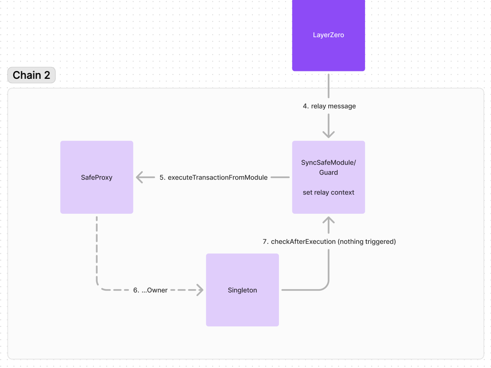

## SyncSafe - A Minimal Implementation of a Cross-Chain State-Drifting Resistant Safe with Layer Zero

## Abstract

In this repository, we introduce a minimal approach to creating a multi-signature (multisig) safe module and guard, designed to operate seamlessly across multiple blockchain networks. Leveraging Layer Zero technology, our system ensures deterministic address generation given a chain ID and maintains synchronized states (signers and threshold) across all supported chains. This implementation aims to minimize complexity while providing robust security against state drift, thereby enhancing the reliability and usability of multisig safes in a cross-chain environment.

## Problem

The past months have seen a rapid growth in the number of chains used by DeFi users. In this setting, large organizations who operate Gnosis Safe smart wallets regularly need to synchronise their governance across multiple chains.

This process is time consuming as it requires multiple signers to update dozens of safes to synchronise their setup.

## Solution

SafeSync is a Gnosis Safe module which automaticly synchronises the state of a safe across chains.

The first step is to deploy your first SafeSync. For this, choose the chains where you wish to deploy a safe, the more the better.

Then you will witness the automatic deployment of each safe on each network. These safe are part of an integrated network of safes which we call a SyncSafe.

**🔥 From now on**, you don't need to worry about replicating governance updates on each chain. Any governance update of your safe will be replicated across your whole SyncSafe.

You are now future proof and ready to embark safely in a multichain world.

## Technical Diagram

> 1. Initialization of the SafeSync creation

> 2. Synchronisation of the SafeSync creation across chains

> 3. Catching the governance update of a Safe

> 4. Synchronisation of the SafeSync governance update across chains

## Deployments

- Arbitrum [0x8991690990Ea0A47B41c67c7Fa82d717387eAcD9](https://arbiscan.io/address/0x8991690990Ea0A47B41c67c7Fa82d717387eAcD9)
- Basescan [0x8991690990Ea0A47B41c67c7Fa82d717387eAcD9](https://basescan.org/address/0x8991690990Ea0A47B41c67c7Fa82d717387eAcD9)
- Linea [0x8991690990ea0a47b41c67c7fa82d717387eacd9](https://lineascan.build/address/0x8991690990ea0a47b41c67c7fa82d717387eacd9)

## Contributing

If you're interested in contributing, please open an issue in this repository

## Authors

Started at [ETH Global Brussels 2024](https://ethglobal.com/events/brussels) by:

- [@mathisrgt](github.com/mathisrgt) (mathisrgt.eth, [Telegram](t.me/mathisrgt))
- [@maxencerb](github.com/maxencerb) (maxencerb.eth, [Twitter](x.com/_maxencerb))
- [@pybast](github.com/Pybast) (pybast.eth, [pybasteth](x.com/pybasteth))
- [@raouf2ouf](github.com/raouf2ouf) ([Twitter](x.com/raouf2ouf))

## License

[MIT](https://github.com/wevm/viem/blob/main/LICENSE) License
